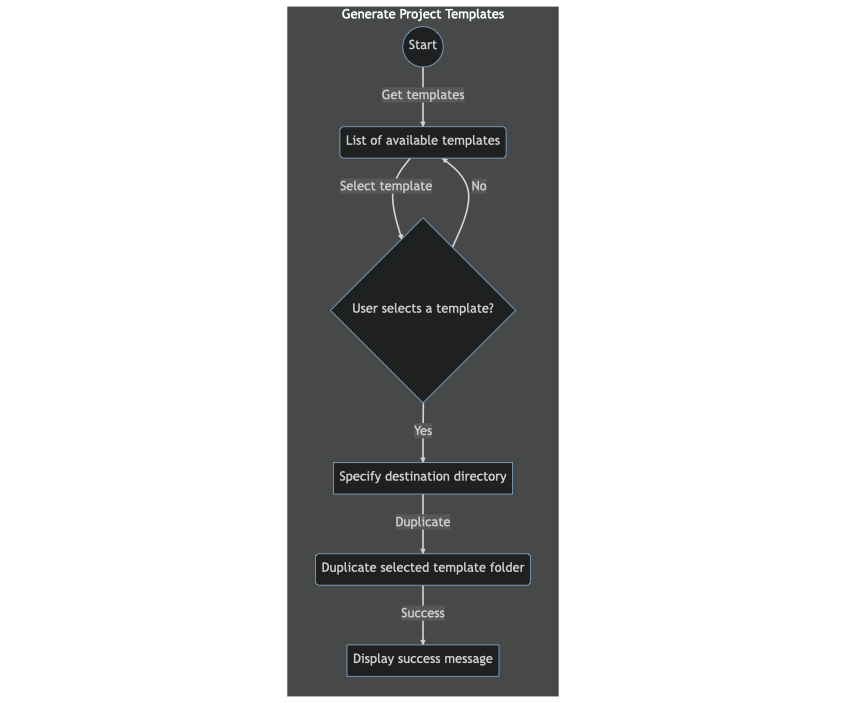

# Requirements for CLI Template Generator

## Goal

Create a CLI tool to generate project templates. The tool should inspect a folder containing templates for different types of projects, allow the user to choose a template, and then duplicate the selected template folder into a new directory.The tool should also make it easy to add new templates in the future via extensibility and support where the templates are stored in the future, such as in a remote repository.

## Features

- A command-line interface that presents the user with a list of available templates
- The ability to select a template from the list.
- The tool should duplicate the selected template folder into a new directory with a unique name.
- The tool should allow the user to specify the destination directory where the new project should be created.
- The tool should have error handling to catch any issues that may arise during the template duplication process.
- The tool should be extensibled to support additional templates in the future.
- The tool should be extensibled to support where the templates are stored in the future. For example, the templates could be stored in a remote repository.

## Technical Requirements

- The tool should be written in JavaScript.
- The tool should be able to run on any operating system.
- The tool should be able to run on any version of Node.js.
- The tool should be able to run on any version of npm.
- The tool should be able to run on any version of Yarn.
- The tool should use the `commander` package to parse command-line arguments.
- The tool should use the `inquirer` package to prompt the user for input.
- The tool should use the `fs-extra` package to duplicate files and directories.
- The tool should use the `chalk` package to style the output.
- The tool should use the `ora` package to display a loading indicator.
- The tool should use the `boxen` package to display a success message.
- The tool should be written using the `log-symbols` module to display a checkmark or an X next to the success message.
- The tool should be written using the `update-notifier` module to inform the user when a new version of the tool is available.

## User Flow

1. User runs the CLI tool in their terminal.
2. The tool presents the user with a list of available templates to choose from.
3. User selects a template from the list.
4. The tool prompts the user to specify the destination directory for the new project.
5. The tool duplicates the selected template folder into the destination directory with a unique name.
6. The tool displays a success message to the user.

[Mermaid js Diagram ref](https://mermaid.ink/img/pako:eNpVUsFOAjEQ_ZVJuUACCQcPsiYaYJELEiN6MJRDaWeh0m03bVclwL877Mqi2aTZvvfmzZu2ByadQpawjRfFFmYv3EojQkgxgxCFj3OiIdPGJK1BfzIZ9O_-KtCgjKgqUYje7TBp9fu39HXrbe9Lq7hNborvbm0iZXZxgOG1RYON_5kSzG0o13W6KVr0IiI8e_dBGnjFvDAEBG6H7fbibNbpQK93f5xihHhhjzBqz3SI4DIQn0IbsTZ4pTvcjqqiRdW5IY4wPrwF9L-JAoiGejhxOz7XwPH97J8uFwVKne1BYYjaiqidBaU91Tm_X3GbVh3SsjBaVt6TdrNpRm78IXNGoadkkzpZKSUGavS4THUgyR5CDUFOi9jgqgk0dzQvt2gVt6zLcvS50Iqu-MAtAGdxizlyltCvEn7HGbcn0okyusXeSpZEX2KXlYWiIKkWdPb5BUSlaZ6n-slUL-f0Axmpy7k)

## Constraints

- Templates should be stored in a directory separate from the CLI tool.
- Templates should be organized into subdirectories by project type.
- Templates should contain all necessary files and dependencies for a basic project setup.
- Templates should be easily maintainable and updatable.
